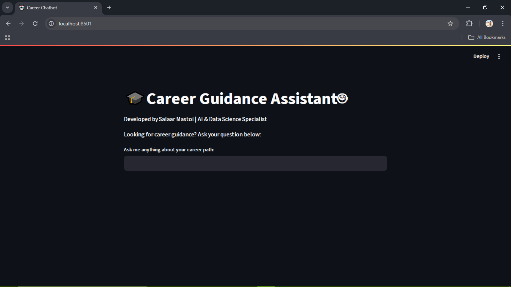

<h1 align="center">🎯 Career Chatbot – AI Career Guidance System</h1>

💬 An intelligent chatbot that helps students make smart career decisions based on their interests, skills, and preferences – powered by <strong>Machine Learning</strong> & <strong>Streamlit</strong>.

  
  
  
  

---

## 🚀 Key Features

- 🤖 Predicts suitable careers based on user questions  
- 📄 Trained on a career guidance Q&A CSV dataset  
- 🧠 Uses TF-IDF Vectorizer + Logistic Regression  
- 🎨 Clean and responsive UI built with Streamlit  
- 💾 Model and vectorizer saved for reuse  
- ➕ Easily extendable with new career data  

---

## 📂 Project Structure

career_chatbot_project/
├── app.py # Streamlit frontend interface
├── train_model.py # ML training script
├── career_guidance_dataset.csv # Dataset of career guidance Q&A
├── intent_model.pkl # Trained ML model
├── vectorizer.pkl # Saved TF-IDF vectorizer
├── requirements.txt # Project dependencies
└── README.md # Documentation

---

## 🛠️ Setup Instructions

### ✅ 1. Clone the Repository

git clone https://github.com/salarmastoi110/career_chatbot_project
cd career_chatbot_project

✅ 2. Create & Activate Virtual Environment
python -m venv venv
venv\Scripts\activate  # On Windows

✅ 3. Install Requirements
pip install -r requirements.txt

▶️ Run the Chatbot
streamlit run app.py
It will open a web app in your browser where you can ask questions like:

💡 "What should I become if I love coding?"
💡 "I enjoy designing – what career suits me?"
💡 "Which field has a good future after FSC?"

🌟 Demo Screenshot

  

🙋 Contact
📧 Email: salarhussainmastoi@gmail.com

🔗 GitHub: @salarmastoi110

💼 LinkedIn: Salar Mastoi

<i>Made with ❤️ to help students discover their dream careers.</i>

